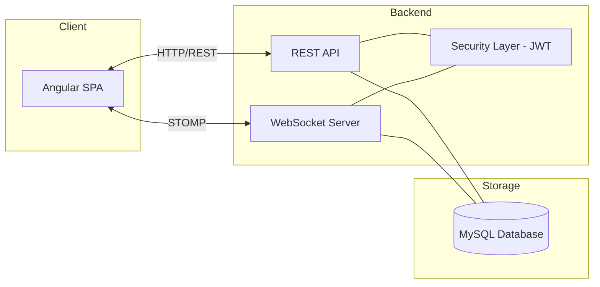

# System Architecture - Univen Intern Register System

## 1. Overview
The system follows a modern decoupled architecture consisting of a standalone Frontend (Angular) and a RESTful Backend (Spring Boot), communicating over HTTPS and WebSockets.

## 2. Technology Stack

### 2.1 Frontend
- **Framework**: Angular 20.x
- **Styling**: Bootstrap 5.x, Vanilla CSS3 (Custom Design System)
- **Maps**: Leaflet.js (for location verification)
- **Real-time**: StompJS & SockJS (WebSocket client)
- **Utilities**: SweetAlert2 (Notifications), SignaturePad (Member verification)

### 2.2 Backend
- **Framework**: Spring Boot 3.3.3
- **Language**: Java 17
- **Security**: Spring Security 6.x (JWT, RBAC, Single Session Control)
- **Persistence**: Spring Data JPA with Hibernate
- **Database**: MySQL 8.x
- **Real-time**: Spring WebSocket (STOMP broker)
- **Documentation**: SpringDoc OpenAPI / Swagger

## 3. High-Level Architecture

## 4. Key Components and Design Patterns

### 4.1 Security Layer (JWT with Single Session Control)
The system implements a robust security layer:
1. **JWT Authentication**: Each request is verified using a stateless JWT token.
2. **Single Session Control**: The backend stores the `currentSessionId` in the `User` entity. If a user logs in from a new device/browser, the old session ID is invalidated, and subsequent requests with the old token are rejected (401 Unauthorized), prompting an automatic logout on the client.

### 4.2 Real-time Infrastructure
The system uses STOMP over WebSockets to provide:
- Instant notification of leave request approvals.
- Real-time attendance monitoring for supervisors.
- Live updates to dashboard statistics.

### 4.3 Location Verification
To ensure attendance integrity, the system uses:
- **Client-side**: Geolocation API captured at the moment of sign-in.
- **Backend-side**: Radius-based verification against authorized coordinate centers stored in the database.

## 5. Data Flow

### 5.1 Sign-In Flow
1. Intern triggers Sign-In in Angular.
2. Frontend captures Coordinates and Signature.
3. Request sent via POST `/api/attendance/sign-in` with JWT.
4. Backend validates:
   - JWT Validity.
   - User active status.
   - Geolocation proximity to allowed site.
5. On success, attendance state is broadcasted via WebSocket to relevant Supervisor/Admin.
